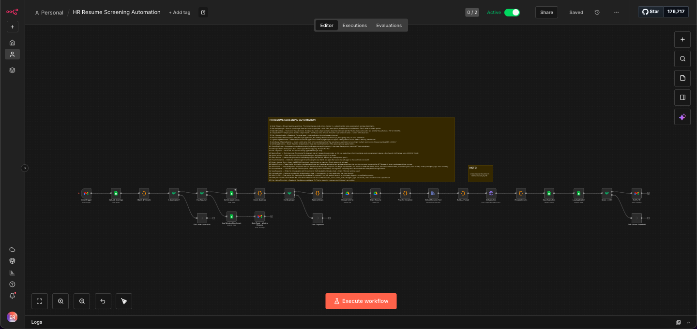
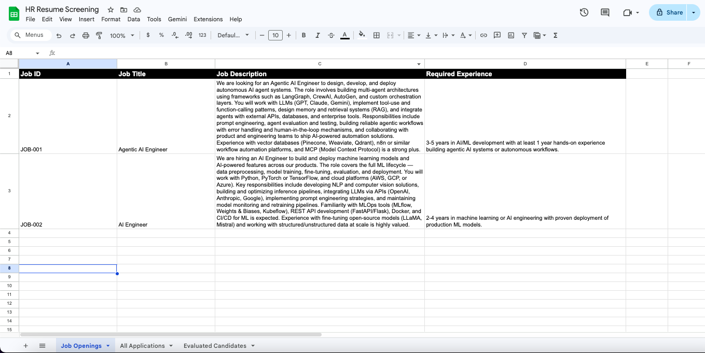
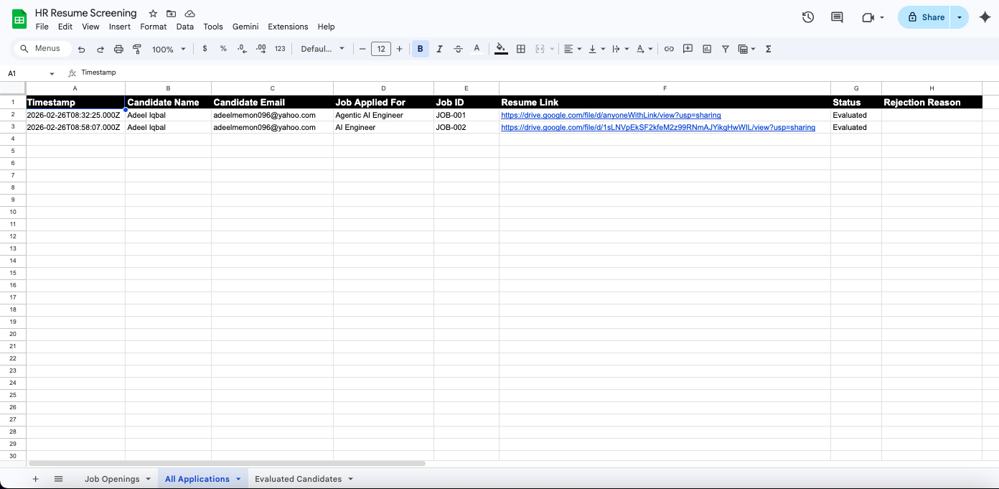
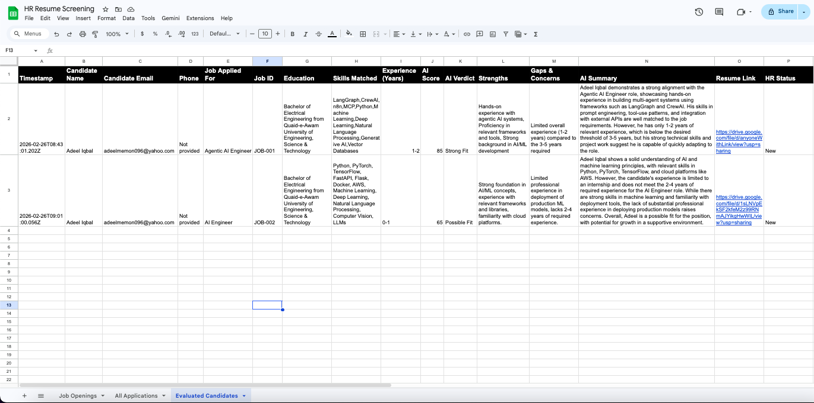
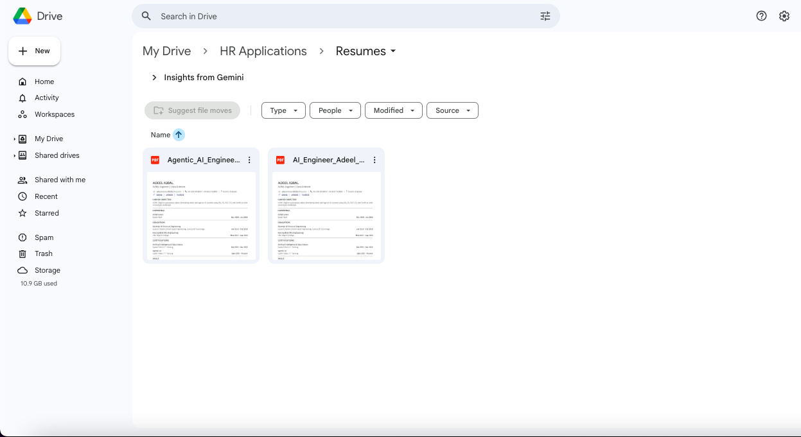
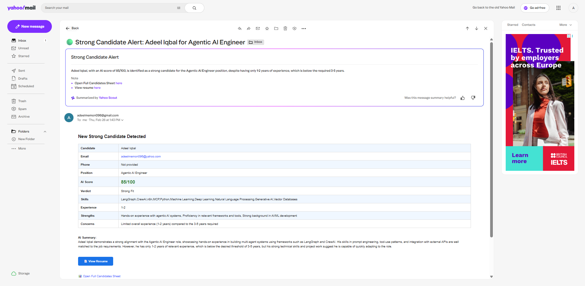

# 📄 HR Resume Screening Automation

An end-to-end automation system built on **n8n** that takes over the entire resume screening process. From the moment a candidate sends an email to the moment HR gets a detailed evaluation report, everything happens automatically. No manual screening, no spreadsheet juggling, no missed applications.

Built with **n8n**, **OpenAI (GPT-4o)**, **Gmail**, **Google Sheets**, and **Google Drive**.

---

## 🔍 The Problem

Hiring is broken at the screening stage. HR teams spend **hours every day** opening emails, downloading resumes, reading through them, comparing against job descriptions, and deciding who's worth a call. Multiply that by dozens or hundreds of applications per role, and it becomes a full-time job just to filter candidates.

Here's what typically goes wrong:

- Resumes sit unread in the inbox for days
- Good candidates get buried under spam and irrelevant emails
- Screening is inconsistent because different people evaluate differently
- There's no central log of who applied, when, and for what
- HR only finds out about strong candidates when they manually check

This system eliminates all of that.

---

## ⚙️ What This System Does

Once deployed, this workflow runs **24/7 on autopilot**. It watches the HR inbox, identifies job applications, validates attachments, screens resumes using AI, and delivers scored evaluations to HR. Every application is logged, every resume is stored, and every strong candidate triggers an instant alert.

Here's how the pipeline flows:

```
📬 Gmail Trigger
 └── 📋 Get Job Openings
      └── 🔎 Match & Validate
           └── ❓ Is Application?
                ├── ❌ NO → Ignored silently
                └── ✅ YES → Has Resume?
                     ├── ❌ NO → Log + Auto Reply to Candidate
                     └── ✅ YES → Duplicate Check
                          ├── 🔁 DUPLICATE → Skipped
                          └── 🆕 NEW → Upload Resume to Drive
                               └── 🔗 Share Resume (Public Link)
                                    └── 📝 Extract Resume Text
                                         └── 🤖 AI Evaluation (GPT-4o)
                                              └── 💾 Save Evaluation
                                                   └── 📊 Log Application
                                                        └── 🏆 Score >= 70?
                                                             ├── ✅ YES → Notify HR
                                                             └── ⏸️ NO → Logged Only
```

Every possible scenario is handled. Random emails are ignored. Applications without resumes get a polite auto-reply. Duplicate applications are silently skipped. And only qualified candidates make it to HR's attention.

---

## 📸 Screenshots

<table>
  <tr>
    <td align="center" width="50%">
      
      <br/><b>🔧 Complete n8n Workflow</b>
    </td>
    <td align="center" width="50%">
      
      <br/><b>📋 Job Openings Sheet</b>
    </td>
  </tr>
  <tr>
    <td align="center" width="50%">
      
      <br/><b>📊 All Applications Log</b>
    </td>
    <td align="center" width="50%">
      
      <br/><b>🤖 Evaluated Candidates Sheet</b>
    </td>
  </tr>
  <tr>
    <td align="center" width="50%">
      
      <br/><b>📁 Resume Storage (Google Drive)</b>
    </td>
    <td align="center" width="50%">
      
      <br/><b>✉️ HR Email Notification</b>
    </td>
  </tr>
</table>

---

## ✨ Key Features

- 🎯 **Intelligent Job Matching** — Automatically identifies which job a candidate is applying for based on the email subject line
- 📎 **Attachment Validation** — Checks for PDF/DOCX resumes and auto-replies if missing
- 🔁 **Duplicate Detection** — Prevents the same candidate from being processed twice for the same role
- 🤖 **AI-Powered Evaluation** — Scores resumes against job descriptions using GPT-4o, returning a detailed breakdown of skills, experience, strengths, and gaps
- 📊 **Structured Scoring** — Every candidate gets a score (0-100) and a verdict: Strong Fit, Possible Fit, or Weak Fit
- 📁 **Automated Resume Storage** — Resumes are renamed cleanly and uploaded to Google Drive with shareable links
- 🔔 **Real-Time HR Alerts** — Top candidates (score 70+) trigger an instant HTML email notification with full evaluation details
- 📝 **Complete Application Logging** — Every application is tracked in Google Sheets with timestamps, status, and resume links

---

## 💰 How It Saves Time and Money

| Without This System | With This System |
|---|---|
| HR manually opens every email | Emails are filtered and processed automatically |
| Resumes are downloaded and read one by one | AI reads and evaluates every resume in seconds |
| Screening takes 10-15 minutes per resume | Screening takes under 30 seconds per resume |
| Good candidates get lost in the inbox | Top candidates trigger instant alerts |
| No central record of applications | Every application is logged with full history |
| Inconsistent evaluation across reviewers | Every candidate is scored by the same AI criteria |

**For a company receiving 50 applications per week:**
- ⏳ Manual screening: ~10 hours/week of HR time
- ⚡ With this system: ~0 hours. It runs itself.
- 💵 Estimated monthly savings: **40+ hours of HR work**, letting your team focus on interviews and hiring decisions instead of inbox management.

---

## 🛠️ Tech Stack

| Service | Role |
|---|---|
| **n8n** | Workflow automation platform |
| **Gmail** | Email trigger, auto-replies, HR notifications |
| **Google Sheets** | Job openings, application logs, evaluation data |
| **Google Drive** | Resume storage with public sharing |
| **OpenAI GPT-4o** | AI-powered resume evaluation and scoring |

---

## 🧠 Decision Logic

| Email Type | Action | HR Notified? |
|---|---|---|
| Random email (not a job application) | Ignored silently | ❌ No |
| Job application without resume | Logged + Auto-reply sent | ❌ No |
| Duplicate application | Skipped silently | ❌ No |
| Valid application, AI score below 70 | Full evaluation + logged | ❌ No |
| Valid application, AI score 70 or above | Full evaluation + logged + HR alert | ✅ Yes |

---

## 🚀 Want This System for Your Team?

This is a **production-ready automation** that I built, tested, and deployed end to end. It's not a template or a tutorial project. It works.

I offer this as a **ready-to-deploy product** and also provide **custom builds** tailored to your specific hiring workflow, tools, and requirements.

**What you get:**
- ✅ Complete n8n workflow (fully configured and tested)
- ✅ Google Sheets setup with all required tabs and columns
- ✅ Google Drive folder structure for resume storage
- ✅ AI evaluation prompt optimized for accurate resume screening
- ✅ Deployment support and walkthrough

**Need modifications?** I can customize the workflow for different email providers, applicant tracking systems, evaluation criteria, notification channels, or any other requirement you have.

### 📬 Let's Talk

| | |
|---|---|
| 📧 **Email** | adeelmemon096@yahoo.com |
| 💬 **WhatsApp** | [+92 314 711 6890](https://wa.me/923147116890) |
| 🐙 **GitHub** | [adeel-iqbal](https://github.com/adeel-iqbal) |
| 💼 **LinkedIn** | [adeeliqbalmemon](https://linkedin.com/in/adeeliqbalmemon) |

---

<p align="center"><i>Built by Adeel Iqbal</i></p>
